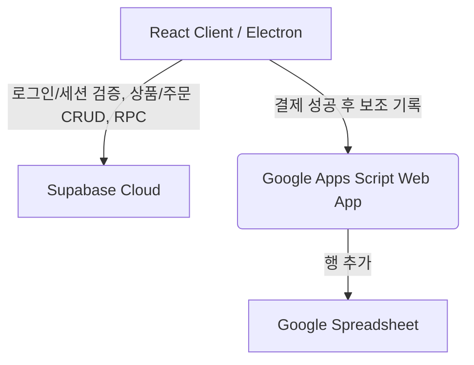

# 🖥️ Simple POS System

<p align="center">
  
  
  
  
  
</p>

<p align="center">
  <strong>소규모 카페, 베이커리, 동네 상점을 위한 데스크톱 포스기(POS) 시스템</strong><br />
  Supabase(Postgres + Auth)를 메인 DB로 쓰고, 결제 성공 후 구글 스프레드시트에 보조 기록을 남깁니다.
</p>

---

## ✨ Key Features (주요 기능)

- **🔒 Secure Login & RBAC**: Supabase Auth 기반 로그인, Owner/Manager/Staff 역할별 권한 분리, 매장(store) 단위 격리
- **⚡ Fast Checkout**: 반응성 빠른 상품 그리드와 장바구니, 품목별/전체 할인(할인 제외 품목 지정 가능)
- **📂 Sales History & Refunds**: 매출 내역 조회, 통계 대시보드, 매출 추이 차트, 주문 전체/품목별 부분 환불
- **🧾 Closing Report**: 마감 정산서 생성, 프린터 드라이버와 무관하게 항상 정확한 폭으로 PDF 저장
- **👥 Employee & Customer Management**: 직원 초대/권한 관리, 고객 마일리지 조회
- **📊 Secondary Sheet Log**: 결제 완료 후 구글 스프레드시트에 1행씩 보조 기록 (조회는 앱 내 매출내역이 기준)

---

## 🛠️ Tech Stack (기술 스택)

### Frontend & Desktop
- **UI Framework**: React (v18)
- **Programming Language**: TypeScript
- **Bundler & Dev Server**: Vite
- **Desktop Runtime**: Electron
- **Styling**: Vanilla CSS

### Backend & Database
- **Primary DB & Auth**: Supabase (PostgreSQL + Auth)
- **Secondary Log**: Google Spreadsheet (Google Apps Script Web API, archive-only)

---

## 📐 Architecture (시스템 아키텍처)



---

## 🚀 Quick Start (시작하기)

### 📋 Prerequisites (필수 조건)
- Node.js (v18 이상 권장)
- npm (Node Package Manager)

### 1. Repository Clone & Install (설치)
```bash
# 레포지토리 클론
git clone https://github.com/cade-beep/ssnr-pos.git
cd ssnr-pos

# 의존성 설치
npm install
```

### 2. Environment Variables Setup (설정)
루트 경로에 `.env` 파일을 생성하고 아래 연동 변수 정보를 입력합니다.

```env
# Supabase Configuration (primary DB + Auth)
VITE_SUPABASE_URL="https://your-supabase-project.supabase.co"
VITE_SUPABASE_ANON_KEY="your-anon-key-here"

# Google Apps Script Web App Deployment URL (archive-only: sales are logged here
# after a successful Supabase write; the app never reads products/settings from it)
VITE_GOOGLE_SHEETS_WEBAPP_URL="https://script.google.com/macros/s/YOUR_DEPLOID_ID/exec"
```

### 3. Run Development (개발 서버 실행)
React Vite 개발 서버와 Electron 데스크톱 런타임이 동시에 구동됩니다.
```bash
npm run dev
```

---

## 🚫 Scope Limits (범위 제한)

- ❌ 바코드 리더기 하드웨어 직접 연동 (바코드 값 매칭 로직은 있음, 리더기 자체 드라이버 연동은 없음)
- ❌ 감열 영수증 프린터 ESC/POS 직접 연동 (정산서 PDF 저장으로 대체)
- ❌ 재고 관리 (도입했다가 폐기됨 — 소규모 매장 특성상 실익이 없다고 판단)

---

## 📄 License

This project is licensed under the [MIT License](LICENSE).
