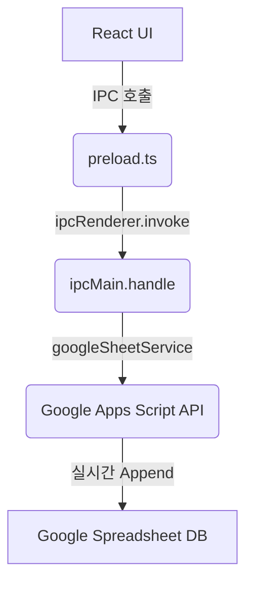

# 🖥️ Simple POS System

<p align="center">
  
  
  
  
  
</p>

<p align="center">
  <strong>소규모 카페, 베이커리, 동네 상점을 위한 초간편 데스크톱 포스기(POS) 시스템</strong><br />
  별도의 서버 구축 없이 <b>구글 스프레드시트</b>를 데이터베이스로 활용하여 매출을 실시간으로 기록하고 관리합니다.
</p>

---

## ✨ Key Features (주요 기능)

- **⚡ Fast Checkout**: 직관적이고 반응성 빠른 상품 그리드와 실시간 장바구니 시스템
- **📊 Real-time Sheet Sync**: 결제 완료 즉시 구글 스프레드시트(Google Spreadsheet)에 결제 내역을 1행 단위로 안전하게 추가
- **📂 Sales History**: 데스크톱 앱 내에서 실시간 매출 내역을 간편하게 스크롤 및 조회 가능
- **🎨 Modern Premium UI**: 다크 모드 기반의 글래스모피즘(Glassmorphism) 스타일과 고급스러운 인터랙션
- **🔒 Secure & Lightweight**: 데이터베이스 서버를 직접 유지할 필요 없이 구글의 클라우드 보안 인프라를 그대로 이용

---

## 🛠️ Tech Stack (기술 스택)

### Frontend & Desktop
- **UI Framework**: React (v18)
- **Programming Language**: TypeScript
- **Bundler & Dev Server**: Vite
- **Desktop Runtime**: Electron (v29)
- **Styling**: Vanilla CSS (Premium Glassmorphic Design)

### Backend & Database
- **API Server / Backend**: Google Apps Script (Apps Script Web App)
- **Database**: Google Spreadsheet

---

## 📐 Architecture (시스템 아키텍처)

이 프로젝트는 안정적이고 단일 경로 통신 모델을 따릅니다:



---

## 🚀 Quick Start (시작하기)

### 📋 Prerequisites (필수 조건)
- Node.js (v18 이상 권장)
- npm (Node Package Manager)

### 1. Repository Clone & Install (설치)
```bash
# 레포지토리 클론
git clone https://github.com/cade-beep/ssnr-pos.git
cd ssnr-pos

# 의존성 설치
npm install
```

### 2. Environment Variables Setup (설정)
루트 경로에 `.env` 파일을 생성하고 구글 Apps Script 웹앱 URL을 입력합니다. (기본 템플릿은 `.env.example`을 참고하세요.)

```env
# Google Apps Script Web App Deployment URL
GOOGLE_SHEETS_WEBAPP_URL="https://script.google.com/macros/s/YOUR_DEPLOID_ID/exec"
```

### 3. Run Development (개발 서버 실행)
React Vite 개발 서버와 Electron 데스크톱 런타임이 동시에 구동됩니다.
```bash
npm run dev
```

---

## 🚫 Scope Limits (MVP 프로젝트 범위 제한)

이 프로젝트는 심플하고 신뢰도 높은 MVP(최소 기능 제품)를 지향합니다. **다음 기능들은 기본 범위 외(Out of Scope)에 해당합니다:**
- ❌ 바코드 리더기 및 영수증 프린터 하드웨어 연동
- ❌ 회원 관리, 쿠폰 및 복잡한 포인트 적립 시스템
- ❌ 다중 매장 및 직원 관리 시스템
- ❌ 별도의 로컬/서버용 관계형 DB 구축 (구글 스프레드시트 단독 사용)

---

## 📄 License

This project is licensed under the [ISC License](LICENSE).
